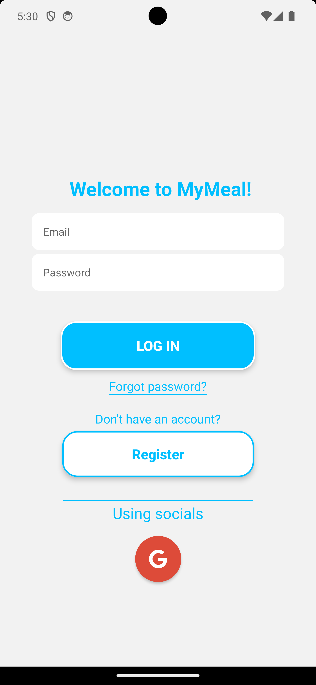
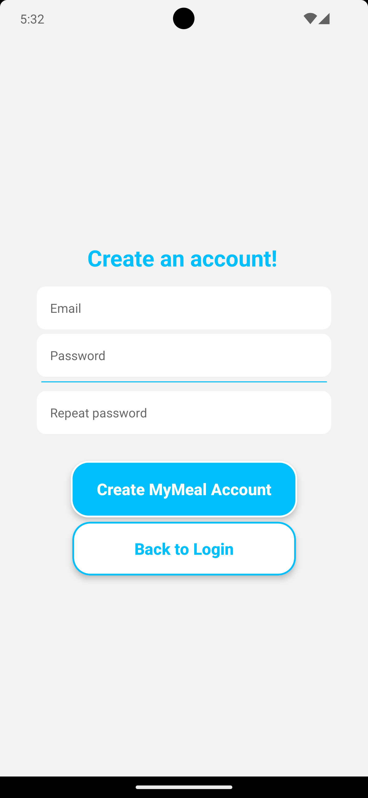
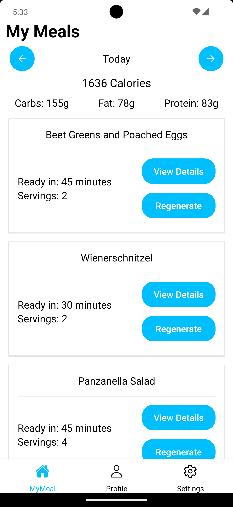
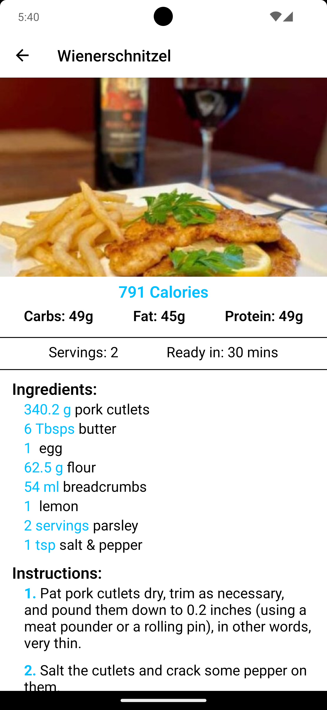
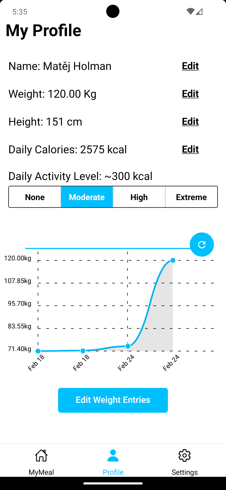
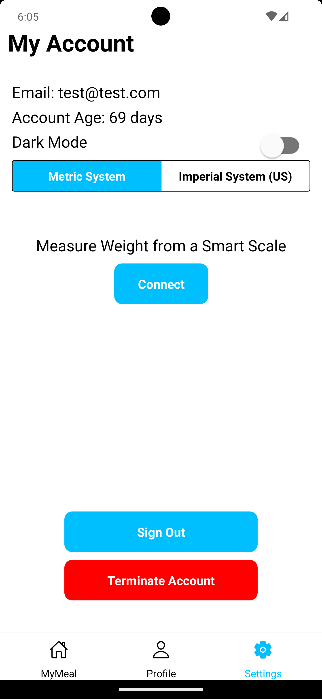
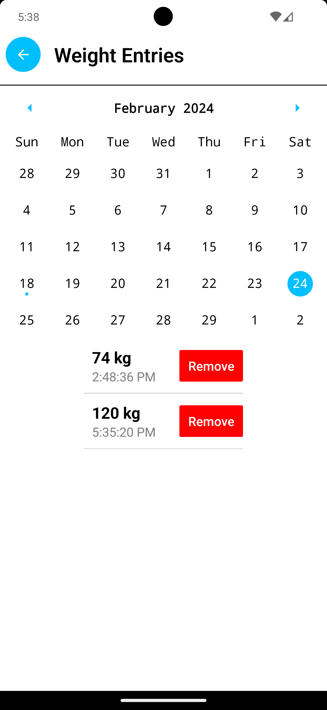

# MyMeal

## Popis projektu:

MyMeal je aplikace pro plánování jídel, která vám pomáhá organizovat vaši stravu a nakupování ingrediencí. Tato aplikace umožňuje uživatelům plánovat své jídla na jednotlivé dny, což usnadňuje každodenní rozhodování ohledně jídla. Aplikace také umožňuje sledovaní váhy uživatele aby mohl vědět, zda daný jídelníček funguje.

### Login & Register Screens

    
    

### Your Meal Screen (with generated meals) & Meal Detail Screen

    
    

### Profile & Settings Screens

    
    

### Weight Entries Screen

    

